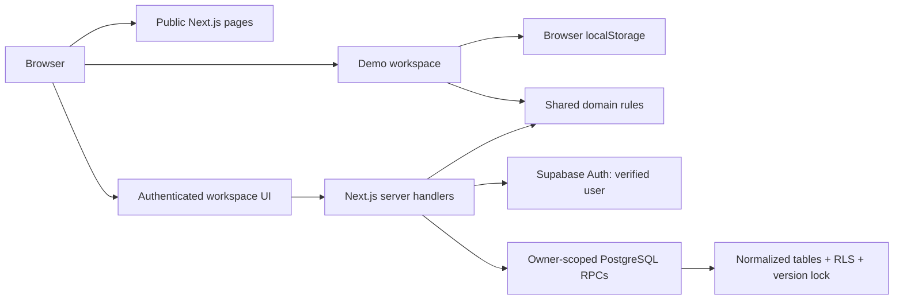

# WealthWise architecture

WealthWise is one modular Next.js application deployed to Vercel. Shared TypeScript packages own the workspace contracts, deterministic financial rules and fictional sample data. Supabase provides identity and normalized PostgreSQL storage for authenticated personal workspaces.

This document describes the implemented application. The [historical architecture](../legacy/docs/ARCHITECTURE.md) describes the original Vite/Firebase application and is retained only as a migration reference.

## Runtime and boundaries

Public pages, calculators and lessons are available without authentication. `/demo/*` uses the same feature UI and domain rules as the personal workspace, backed by local browser storage. `/app/*` uses a separate layout that checks Supabase authentication before rendering the workspace. Protected API handlers independently verify the user; a client-side route or workspace identifier does not grant access.

There is no Firebase runtime, Python service, bank connection, licensed quote feed or AI provider in the active application. Supabase Storage is not used yet: the current import flow commits validated records and does not retain source files.

## Code ownership

| Location | Owns |
| --- | --- |
| `apps/web/app` | Public, auth, demo and personal routes; API handlers; metadata and error boundaries. |
| `apps/web/components` | Shared controls, responsive shell and workspace state provider. |
| `apps/web/features` | Finance, planning, practice, learning, insights, onboarding, settings and public/auth UI. |
| `apps/web/server` | Verified-user service, command execution and HTTP/database error mapping. |
| `apps/web/lib/supabase` | Configuration validation and browser/server clients. |
| `packages/contracts` | Zod schemas, bounded command payloads, records and workspace types. |
| `packages/domain` | Pure commands, valuation, cash flow, debt/SIP calculations and provider interfaces. |
| `packages/demo-data` | Deterministic initial sample records. |
| `supabase/migrations` | Tables, constraints, grants, ownership policies and atomic persistence. |

UI code does not own authoritative financial arithmetic. Commands must pass shared schema validation before domain rules run. The database independently checks ownership, versions, relationships and practice fills. UI primitives currently live within the web application; a separate UI package is unnecessary while there is one frontend consumer.

## Data modes and persistence

| Mode | Storage | Starting state | Refresh behavior |
| --- | --- | --- | --- |
| Demo | `localStorage`, key `wealthwise.demo.v1` | Coherent fictional accounts and records. | Reloads this origin's saved sample workspace; reset restores the fixtures. |
| Personal | Supabase PostgreSQL through authenticated server handlers | Empty financial workspace for the verified identity. | Reloads saved server records. Unconfirmed writes remain errors. |

Demo storage is not an account backup or synchronization service. It is shared by visits to the same browser origin, and clearing site storage removes its changes. Account records are not serialized into demo local storage, and authentication failures never promote sample records into an account. Settings exports create a local download; no server file bucket is involved.

## The current write model

The internal commands are meaningful product operations such as `transfer`, `upsert-holding`, `import-transactions` and `place-order`. The current persistence boundary saves a bounded, normalized workspace snapshot using a version check:

1. The browser posts `{ command, expectedVersion }` to `/api/commands`.
2. The handler enforces the same origin, JSON content type, request size and shared payload schema.
3. The server verifies the Supabase user, reads the owned workspace and applies the domain command.
4. `wealthwise_save_workspace` locks the owner's workspace row and compares the expected version.
5. The RPC checks the complete result, updates normalized child collections, preserves existing practice fills and advances the version in one transaction.
6. The verified result returns to the browser. A stale version returns HTTP 409; the UI reloads and asks the user to retry.

This is **not a single JSON database row**: accounts, transactions, holdings, budgets, goals, debts, watchlists, lessons, scenarios and practice orders have normalized tables. It is also not a fully granular SQL command service: most manual collections are replaced as part of each accepted snapshot. The workspace is capped at 10,000 transactions and bounded related collections. A future high-volume implementation should add aggregate-specific persistence behind the existing domain boundaries, retaining atomicity and concurrency checks.

A version check prevents replaying a successful stale request as a second transfer or fill. If the network loses a response, reload to determine whether it committed before retrying. Practice fills are append-only, priced from a read-only fictional catalog and validated again in SQL against available cash and owned quantities.

## Storage and identity

One Supabase user owns one personal workspace. Private rows carry `user_id`; RLS exposes only that user's rows. Account/transaction foreign keys include the owner so records cannot reference another user's account. Direct client writes to private financial tables are revoked. The public RPCs derive ownership from `auth.uid()` and do not accept a caller-supplied owner.

Server clients use the user's session and publishable/anon key. No service-role credential is required for current user flows. Auth callbacks allow only the intended destinations; mutations validate their origin. The [backend reference](backend.md) documents SQL functions, grants, request limits, error semantics and email-confirmation flows in detail.

## Financial model

- **Currency and precision:** INR only. Monetary values are integer paise, bounded to safe JavaScript integers and stored as PostgreSQL `bigint`. Decimal arithmetic handles authoritative projections and fractional holding valuation. Holding quantity supports six decimal places.
- **Accounts:** balance is opening balance plus signed entries. A transfer writes matched entries and is excluded from income/spending totals. This is a manual finance model, not a double-entry accounting system.
- **Investments:** quantity, average cost and dated current price are manually supplied. Displayed gain is a simple value-versus-cost difference, not annualized return or verified investment performance.
- **Net worth:** current account balances plus current holding values minus recorded debt. Goal earmarks and practice cash/positions are excluded.
- **Practice:** immediate full market fills against fixed fictional prices, starting with ₹10,00,000 virtual cash. No exchange orders, partial fills, limit-order reservations or real money movement.
- **Planning:** SIP, EMI and goal scenarios retain input assumptions. Calculators recompute their output from those inputs; immutable engine-versioned result snapshots are a future extension. Results exclude fees/taxes and other assumptions stated in the UI.
- **Insights:** deterministic observations over the recorded data. Missing records affect the result; there is no generated AI advice or scheduled notification delivery.

CSV imports are limited to 500 rows and 2 MB before confirmation. The authenticated command request also has a 256 KB limit, so a large text-heavy batch may need splitting even when its CSV fits. Validation rejects the whole batch if any row is invalid. Deterministic import IDs skip the same unchanged file's previously imported records; edited or reordered files need review. The workspace JSON export is an archive for inspection, not an implemented full-archive restore format.

## Routes and interface

The public application includes `/`, `/product`, `/about`, `/security`, `/privacy`, `/terms`, `/help`, `/learn`, `/learn/[slug]` and `/calculators`. Authentication lives at `/signup`, `/login`, `/recover` and `/update-password` with dedicated callback/confirmation handlers.

Both `/demo` and `/app` expose these views: `overview`, `accounts`, `transactions`, `budgets`, `portfolio`, `markets`, `goals`, `debt`, `simulator`, `insights`, `learn`, `tools`, `settings` and `onboarding`. Secondary actions use contextual dialogs rather than creating an independent route for every database record.

Design tokens and self-hosted fonts give public pages and application views a consistent hierarchy. Financial controls use a 16px base, large tabular figures, visible focus styles, labeled fields and Radix dialogs. Responsive navigation and reduced-motion styles are included. These implementation choices do not substitute for ongoing accessibility review with real devices and assistive technology.

## Verification and deployment

GitHub CI installs the lockfile with Node 22/pnpm 10.30.3, generates route types, typechecks, runs Vitest and builds Next.js. Tests exercise pure financial rules, import handling, server boundaries and the actual migrations in PGlite with Supabase auth/role stubs.

PGlite checks SQL behavior; it does not prove hosted email delivery, network authentication, PostgREST behavior, multi-connection concurrency, production backup recovery or deployed isolation. Complete the [deployment runbook](deployment.md) checks against the selected staging/production configuration before storing real data.

## Next extension points

Add licensed market and AI adapters behind typed server interfaces, with explicit source and freshness metadata. Long-running research will need durable jobs and persisted statuses; an unawaited function after a Vercel response is not a job system. Private file buckets, audit events, household membership, granular persistence, historical valuation snapshots and provider scheduling remain separately scoped work.

The [migration guide](migration.md) explains deliberate differences from the original three repositories and the broader approved blueprint.
